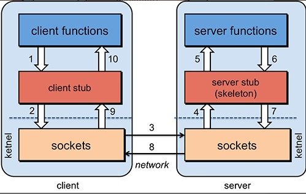

## 1. restful作用?
定义了接口规范
> **资源在网络中以某种表现形式进行状态转移。**
> 资源：每一个URI代表一个资源
> 表现形式：json、xml、jpeg
> 状态转移：客户端通过http的几个动词，对服务端资源进行操作，实现“表现层状态转化”

## 2.http请求图示

## 3.http+restful优缺点
优点：
1. 定义清晰，可读性好

缺点：
1. 效率低。由于http协议属于应用层协议，必须层层封装

##  3.http = rpc？
答案自然是否定的  
> 1. http = 应用层协议（OSI第7层）
> 2. rpc = 接口规范（proto文件） + 序列化、反序列化规范（pb）+ 通信协议（tcp）

## 4.rpc原理图

**在 RPC 期间，会发生以下步骤：**
1. 客户端调用客户端存根。该调用是一个本地过程调用，参数以正常方式压入堆栈。
2. 客户端存根将过程参数打包到消息中，并进行系统调用以发送消息。过程参数的打包称为**编组**。
3. 客户端的本地操作系统将消息从客户端机器发送到远程服务器机器。
4. 服务器操作系统将传入的数据包传递到服务器存根。
5. 服务器存根从消息中解包参数——称为**解组**。
6. 当服务器过程完成时，它返回到服务器存根，它将返回值**编组**到消息中。
7. 然后服务器存根将消息传递给传输层。
8. 传输层将生成的消息发送回客户端传输层
9. 后者将消息传递回客户端存根。
10. 客户端存根**解组**返回参数，然后执行返回给调用者。

## 5.rpc在哪些方面比http效率高？
相同点：
>1. 都基于tcp协议(支持连接复用（http有连接池），不会频繁的创建、销毁连接)
>2. http也可以使用protobuf进行二进制编码

不同点：
> rpc：使用自定义的tcp协议，报头、报文元数据中废数据较多，所以传输效率高

## 6.rpc有哪些特点？
1. 面向服务的封装，针对可用性、效率都做了优化
2. 适合于可以在分布式环境中使用，也可以在本地环境中使用；