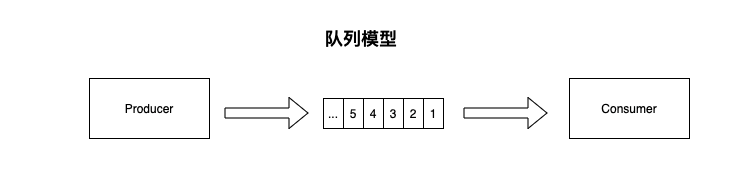
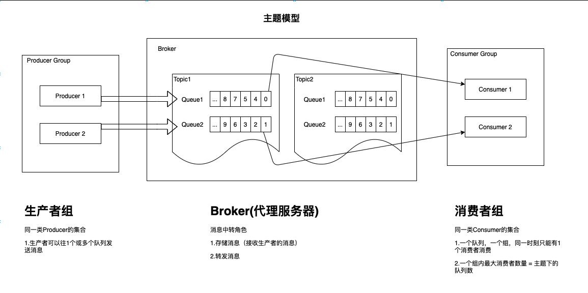
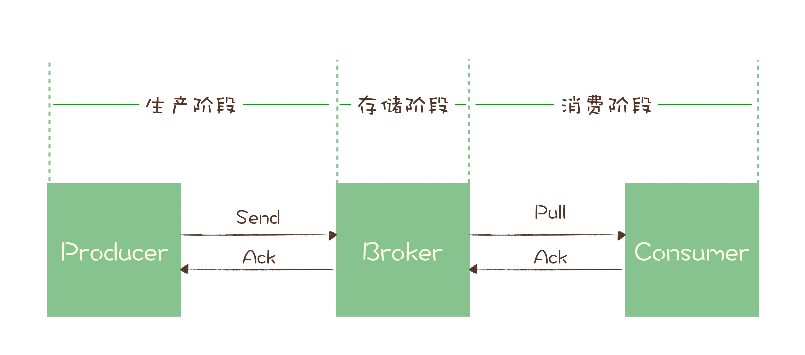

## 1. 概念

### 队列模型
一份消息只会被消费一次

### 主题模型
订阅-发布模式，采用观察者模式来实现  
常用的队列有Kafka、RocketMQ  

**优点**： 
	1. 天生具备并发操作（队列模型也可以通过扩展来实现） 
	2. 消息保持有序性  

***
## 2 如何保证消息不丢失

> **生产阶段**：生产者生产消息，通过网络将消息发送给broker   
> **存储阶段**：消息存储到Broker端   
> **消费阶段**：消费者从Broker拉取消息，通过网络传输到消费端   

#### 每个阶段如何保证消息不丢失
**生产阶段**：发送消息给Broker后，Broker会回复ACK确认，若没有收到ACK，则需要重新发送消息；正确处理返回值或异常就可以保证消息不丢失  
**存储阶段**：若Broker故障或宕机，可能会导致消息丢失，此时需要将消息刷盘或者备份到其他节点，保证消息不丢失  
**消费阶段**：消费端从Broker拉取消息，进行业务处理，成功后，返回ACK给Broker，这样就可以保证消息不丢失  

***
## 3 如何处理消费过程中的重复消息
保证消息的幂等性
1. 利用数据库的唯一约束实现幂等  
	根据关键字段生成唯一主键id
2. 为更新的数据设置前置条件  
	比如要更新某条数据，则在满足这个**前置条件**下再进行更新（如：数据版本，每次更新完后，版本+1）
3. 记录并检查操作  
	消费之前要判断记录的状态，消费完成之后要更新状态
	分布式系统中，会存在比较大的问题：分布式锁、分布式事务
***
## 4 消息积压如何处理
发送端（生产者）：批量发送、并发处理  
消费端：并发处理  

为什么不建议在**消费端**做批量消费？  
1. Broker需要积攒一定数量的消息才能进行发送
2. 业务方需要支持批量消费业务
3. 若有一条消息消费失败，则需要重新消费这批消息