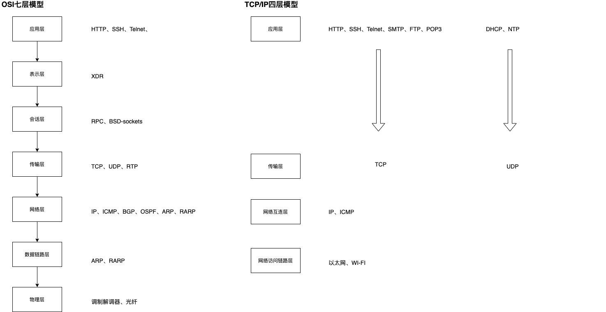
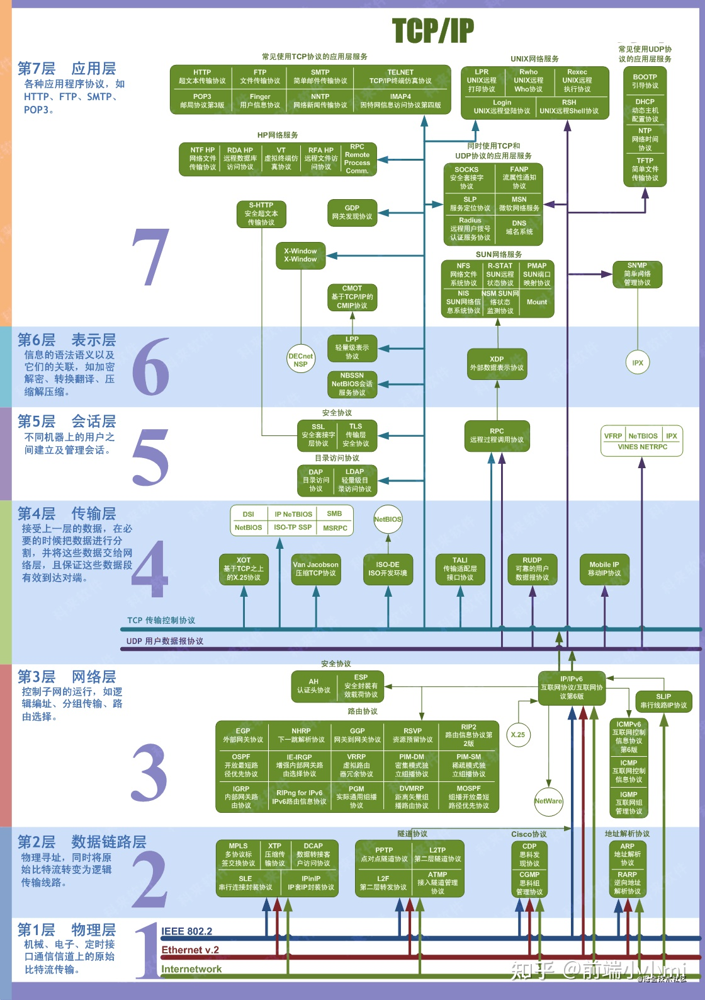

## 1.OSI层模型与TCP/IP模型

## 2.标准OSI模型图

## 3.已经有OSI为什么还需要TCP/IP模型
**OSI**模型属于一个理想情况下的标准，但是不一定都能实现，而**TCP/IP**四层模型则是一种具体实现

## 4.TCP与UDP的区别
1. TCP是面向连接的，UDP是面向无连接的
2. TCP是面向数据流的，数据包超过指定大小时，会进行拆包处理；而UDP是面向用户数据报文的，不会进行拆包处理

## 5.TCP
1. 面向连接的，可靠的

连接：开辟资源
程序与内核内部进行交互（资源的接收、发送队列）
程序想给另外一个APP发送数据：把数据放到发送队列

接收数据：从接收队列中读取数据

长连接、短链接是针对应用层来说的

### 心跳
内核心跳检测：检测当次连接的健康
App心跳检测：检测角色的健康（当服务端是多台服务时，我们无需管是哪台服务器提供的服务，只需要服务可用即可）