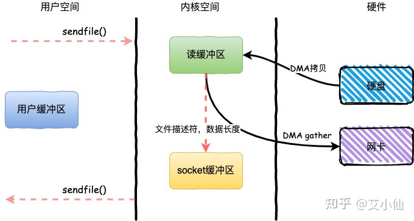

## 1.传统IO模式
进行磁盘IO时，CPU一直在等待IO完成，浪费CPU资源（整个过程都由CPU来控制）

## 2.DMAC
>DMAC（Direct Memory Access Controller）: 主板上一块独立的芯片，直接内存访问控制器  
>作用：我们不再通过CPU来控制数据传输，而是通过DMAC来传输数据，相当于一个协处理器

总线上的设备分为两种： 
**主设备**：主动发起数据传输  
**从设备**：被动接收数据  
DMAC相对于CPU来说是从设备，相对于磁盘来说是主设备

## 3.使用了DMAC后的IO模型

基于传统的IO方式，底层实际上通过调用read()和write()来实现。 

通过read()把数据从硬盘读取到内核缓冲区，再复制到用户缓冲区；然后再通过write()写入到socket缓冲区，最后写入网卡设备。

整个过程发生了**4次用户态和内核态的上下文切换**和**4次拷贝**，具体流程如下：

1. 用户进程通过read()方法向操作系统发起调用，此时上下文从用户态转向内核态
2. DMA控制器把数据从硬盘中拷贝到读缓冲区
3. CPU把读缓冲区数据拷贝到应用缓冲区，上下文从内核态转为用户态，read()返回
4. 用户进程通过write()方法发起调用，上下文从用户态转为内核态
5. CPU将应用缓冲区中数据拷贝到socket缓冲区
6. DMA控制器把数据从socket缓冲区拷贝到网卡，上下文从内核态切换回用户态，write()返回

## 4.零拷贝技术

整个过程发生了**2次用户态和内核态的上下文切换**和**2次拷贝**，其中更重要的是**完全没有CPU拷贝**，具体流程如下：

1. 用户进程通过sendfile()方法向操作系统发起调用，上下文从用户态转向内核态
2. DMA控制器利用scatter把数据从硬盘中拷贝到读缓冲区离散存储
3. CPU把读缓冲区中的文件描述符和数据长度发送到socket缓冲区
4. DMA控制器根据文件描述符和数据长度，使用scatter/gather把数据从内核缓冲区拷贝到网卡
5. sendfile()调用返回，上下文从内核态切换回用户态

## 总结
由于CPU和IO速度的差异问题，产生了DMA技术，通过DMA搬运来减少CPU的等待时间。

传统的IOread+write方式会产生2次DMA拷贝+2次CPU拷贝，同时有4次上下文切换。

而通过mmap+write方式则产生2次DMA拷贝+1次CPU拷贝，4次上下文切换，通过内存映射减少了一次CPU拷贝，可以减少内存使用，适合大文件的传输。

sendfile方式是新增的一个系统调用函数，产生2次DMA拷贝+1次CPU拷贝，但是只有2次上下文切换。因为只有一次调用，减少了上下文的切换，但是用户空间对IO数据不可见，适用于静态文件服务器。

sendfile+DMA gather方式产生2次DMA拷贝，没有CPU拷贝，而且也只有2次上下文切换。虽然极大地提升了性能，但是需要依赖新的硬件设备支持。

## 参考文章
> 1. [零拷贝技术](https://zhuanlan.zhihu.com/p/357820303)
