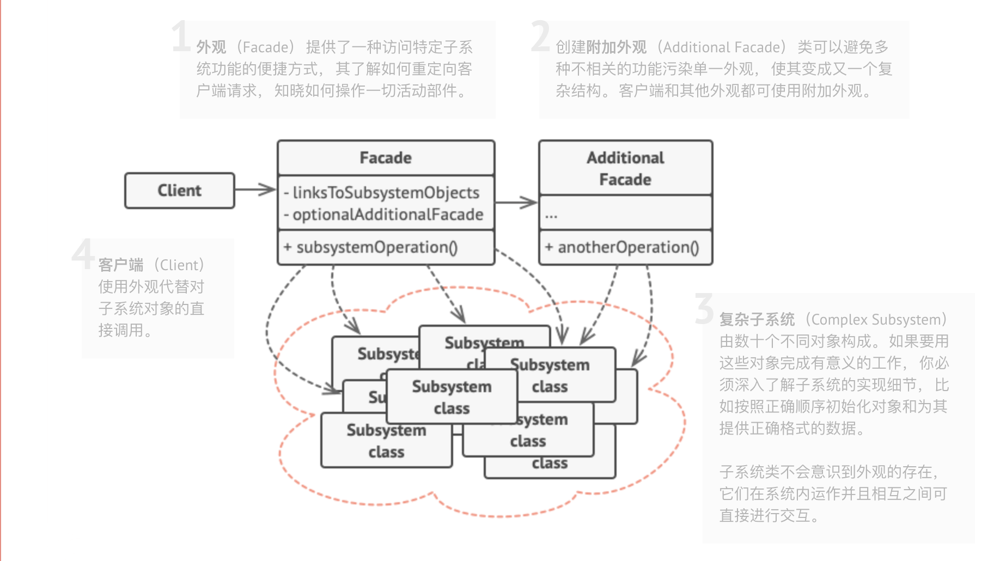
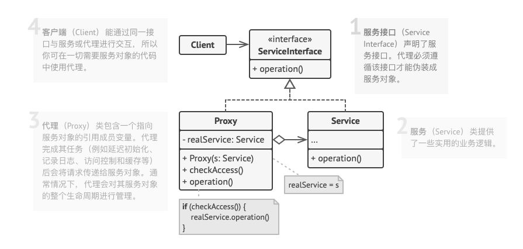

## 1.门面模式（外观模式）
> 提供一个外部访问的接口，无需关注内部复杂实现

### 1.1.UML类图

### 1.2.适用场景
1. 一个指向复杂子系统的接口，且该接口的功能有限
2. 将子系统组织为多层结构

### 1.3.优点
1. 调用方无须关注子系统的复杂实现

### 1.4.缺点
1. 门面类需要耦合多个服务

## 2.代理模式
> 代理控制着原对象的访问，并允许在请求提交给对象前后进行一些处理  
> 新建一套与原服务**对象接口**相同的类（继承原服务的接口，实现相同的方法）

### 2.1.UML图

### 2.2.适用场景
1. 访问控制（可以通过代理类来控制权限）
2. 本地执行远程服务（代理通过网络访问传递客户端请求，负责处理与网络相关的复杂细节）
3. 记录请求日志（在服务访问之前加入一些日志记录）

### 2.3.优点
1. 不破坏原有服务的情况下，加入处理逻辑
2. 对原有服务的生命周期进行管理
3. 即使服务对象还没有创建好，代理服务依然可以正常工作

### 2.4.缺点
1. 代码会变得相对复杂
2. 服务响应可能会延迟

## 3.相同点
1. 都缓存了一个复杂实体，并自行对其初始化

## 4.区别
1. 代理类需要实现原服务的接口功能，而门面类不需要（代理类可以与原服务类互换）