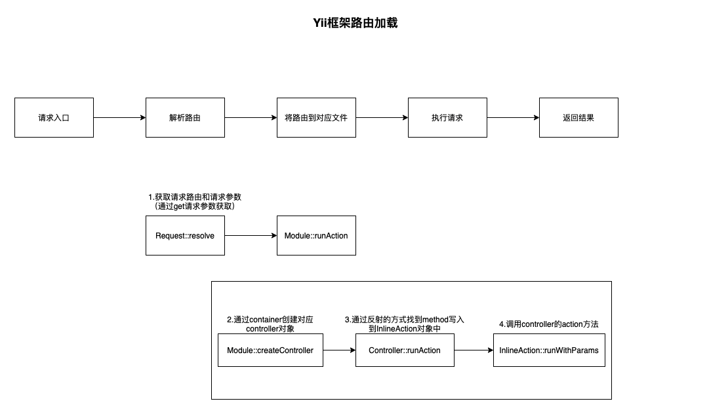
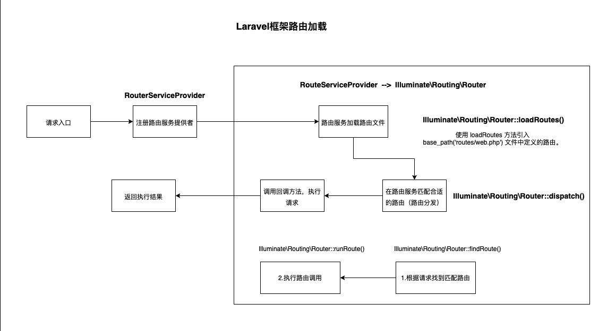

## 1.Yii框架路由加载策略

> 特点：根据请求路由信息，找到路由文件（效率高）

## 2.Laravel框架路由加载策略

> 特点：(服务提供者)
> 1. 注册路由服务提供者
> 2. 往路由提供者注册路由文件
> 3. 从路由服务提供者中匹配出合适路由对象

## 对比
### 实现思路
`Laravel`采用**服务提供者**，定义了路由服务，负责路由的生命周期管理  
`Yii`并没有指定路由服务类，而是在`Application`中内置了路由加载策略

由实现思路对比来看
1. Laravel采用的OOP，设计思想、可读性更好
2. Yii路由加载性能更好，主要体现在如下几个方面：
	- Yii根据请求路由找对应处理类，时间复杂度低于Laravel
	- Laravel支持正则匹配（正则匹配效率不高）
3. Laravel扩展性更好  
	- 由于路由定义成一个服务，方便统一处理
	- 在路由服务前后可以进行一些`middleware`操作，进行数据过滤、处理

### Laravel怎样更好的提供路由匹配效率
1. 开启缓存
2. 路由文件只设置一条路由规则，这条路由规则控制路由跳转