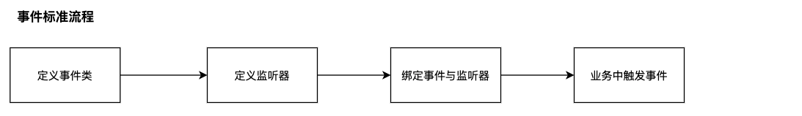
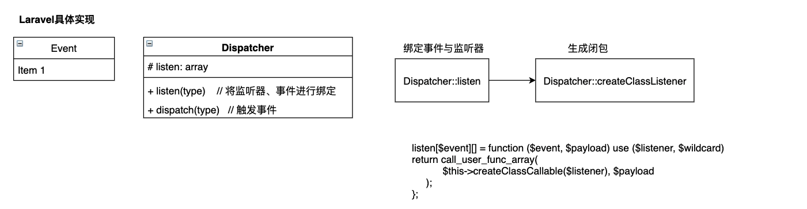
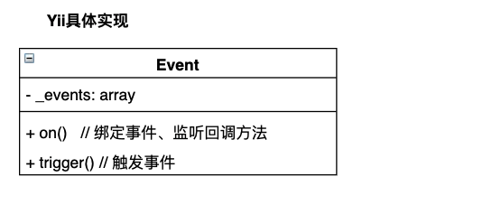

事件都是通过**观察者模式**来进行实现

## 1.事件的标准流程

## 1.Laravel事件实现

## 2.Yii事件实现机制
 

Yii中实现逻辑类似

## 3.区别
1. 绑定事件与监听器方式不一致 
 - laravel在`EventServiceProvider`中绑定，位置明确、清晰
 - Yii允许在代码的任何位置进行绑定

2. 绑定事件后，保存的监听器格式不一致，触发监听器方式不一致
 - laravel中存储的是闭包
 - Yii中存储的是回调类和方法

3. 监听器触发方式不一致
 - laravel中大一统，必须使用`handle`方法，且接收的唯一参数为`Event`对象
 - Yii中允许**定义任意名称**的方法，且接收的唯一参数为`Event`对象

## 4.总结
> 整体上看：
> 1. 框定绑定事件与监听器位置、监听器的回调方法名称统一会使项目更具有美感、可维护性