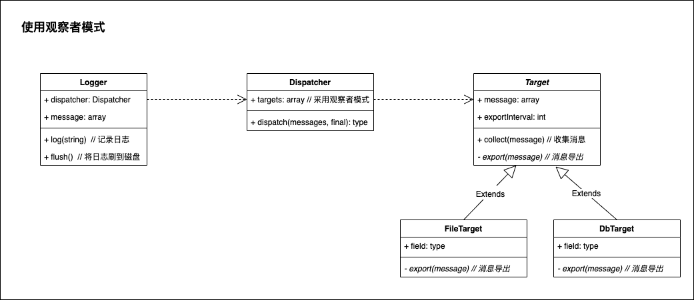
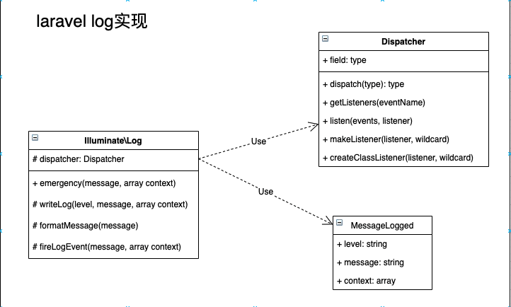
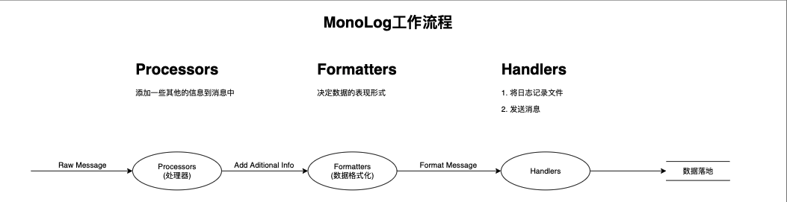
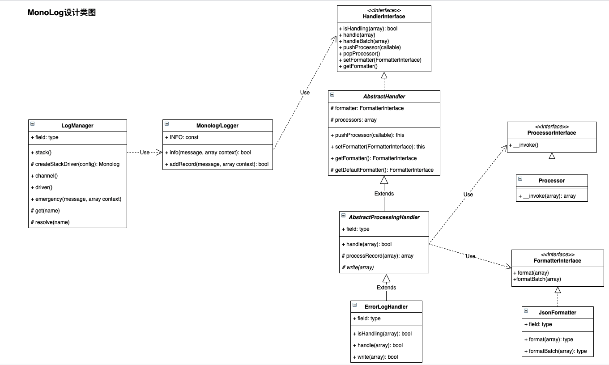

## 1.Yii中日志实现
Yii主要采用`观察者模式`来进行单日志多`target`的模式收集

UML类图如下

> 整体上比较简单、清晰，也方便扩展，将日志收集到日志服务器中

## 2.Laravel日志实现
### 2.1.Laravel自身的日志实现
UML类图如下  

> 实现与Yii类似

### 2.2.Monolog实现
#### 2.2.1.Monolog工作流程

#### 2.2.2.Monolog类图实现

> Monolog消息功能更加完整、结构更清晰